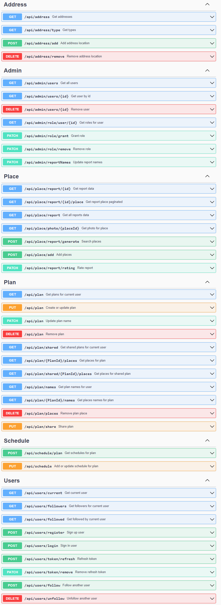
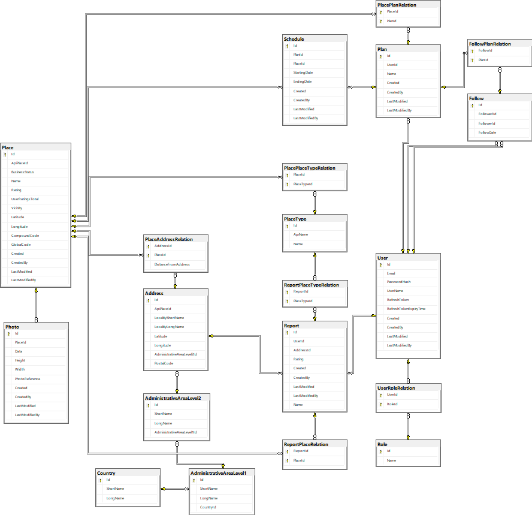

# About project
## JourneyMate

The **JourneyMate** app has been designed to facilitate efficient planning and organization of trips for users. The main objective of the application is to enable personalized searches for tourist attractions in selected travel destinations, as well as to simplify the sharing of these plans with other users. Additionally, the app offers robust schedule planning features to enhance the overall travel experience. Below is a description of the main features of the application:

### Personalized Attraction Search:

- Users can enter their travel destination and browse personalized recommendations for tourist attractions.

### Adding to Travel Lists: (to-do)

- Found attractions can be added to personal travel lists, creating personalized plans.

### Sharing Travel Lists: (to-do)

- Users have the option to share their lists with other JourneyMate users.

### Schedule: (to-do)

- The app allows users to create schedules for each travel list.

### Reviews and Ratings: (to-do)

- Users can add reviews and ratings for other users' lists.
- Users can rate search results.

The **JourneyMate** app aims to simplify trip planning, providing tools for personalized exploration of places, and sharing those experiences with fellow travelers. The goal is to create a comprehensive tool that not only facilitates trip organization but also inspires new discoveries and encourages the shared exploration of the world among travel enthusiasts.

# Used Design Pattern:
<ul>
	<li>Clean architecture</li>
  <li>CQRS</li>
</ul>

# Technologies:
<ul>
  <li>C# 11</li>
	<li>ASP.NET Core 7</li>
	<li>Entity Framework Core 7</li>
	<li>SQL Server</li>
  <li>React</li>
  <li>Typescript</li>
</ul>

# Used Libraries:
<ul>
	<li>MediatR</li>
	<li>FluentValidation</li>
  <li>AutoMapper</li>
  <li>Newtonsoft.Json</li>
  <li>Serilog</li>
  <li>Humanizer</li>
  <li>Swagger</li>
</ul>

# Swagger

# Database

